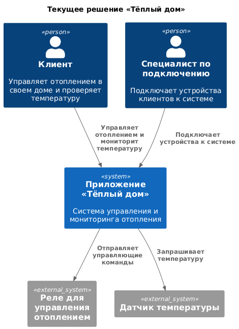
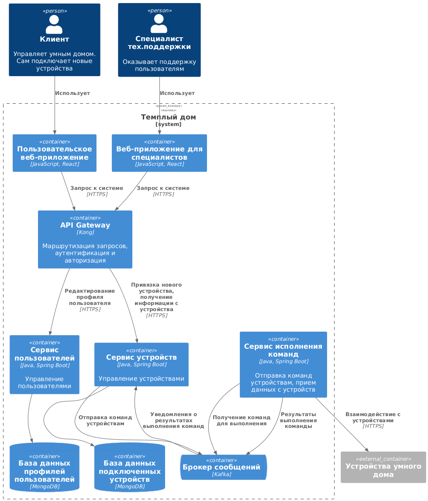
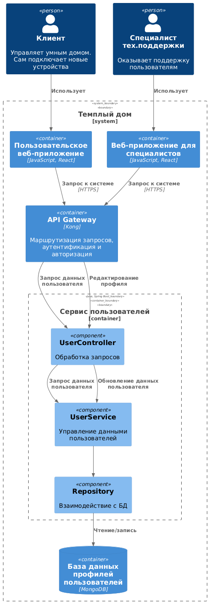
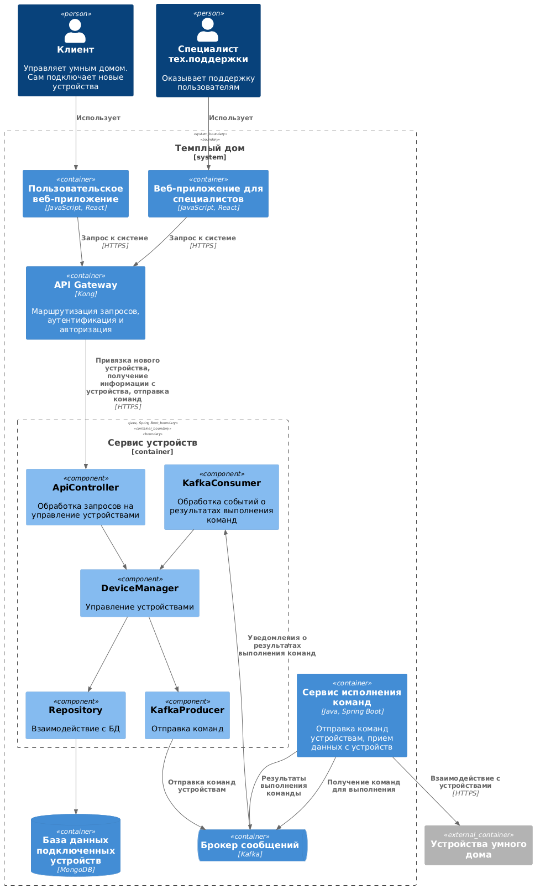
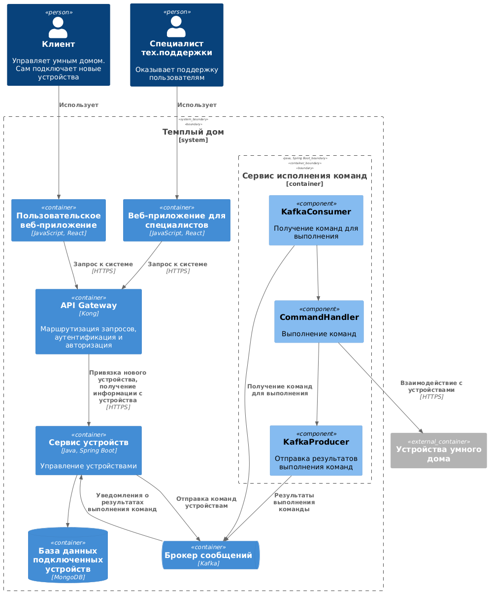
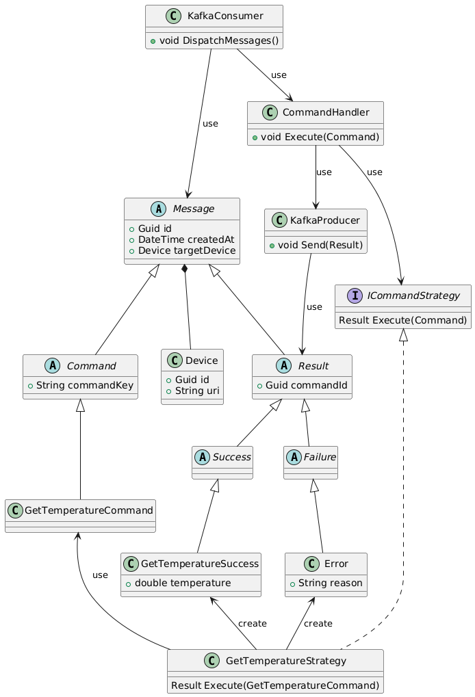

# Задание 1. Анализ и планирование

### 1. Описание функциональности монолитного приложения

**Управление отоплением:**

- Пользователи могут удаленно
	- включать и отключать отопление в своих домах,
	- устанавливать желаемую температуру в своих домах.
- Система поддерживает
	- подключение новых пользователей и их систем отопления силами квалифицированного специалиста (сотрудника компании),
	- хранение настроек подключенных систем отопления,
	- управление подключенными системами отопления посредством синхронных вызовов.

**Мониторинг температуры:**

- Пользователи могут просматривать температуру в домах.
- Самостоятельно подключить свой датчик к системе пользователь не может.
- Система поддерживает
	- синхронную коммуникацию с подключенными датчиками температуры,
	- хранение последнего полученного значения для каждого подключенного датчика и соответствующую временную метку.

### 2. Анализ архитектуры монолитного приложения

- Язык программирования: Java
- СУБД: PostgreSQL
- Архитектура приложения представляет из себя монолит. Все компоненты системы (обработка запросов, бизнес-логика, работа с данными) находятся в рамках одного приложения.
- Взаимодействие: Синхронное, запросы обрабатываются последовательно.
- Масштабируемость: Ограничена, так как монолит сложно масштабировать по частям.
- Развёртывание: Требует остановки всего приложения.

### 3. Определение доменов и границы контекстов

- Подключение новых устройств к системе (реле системы отопления в доме пользователя и датчики температуры).
- Управление подключенными устройствами.
- Мониторинг температуры.

### **4. Проблемы монолитного решения**

- **Ограниченные возможности масштабирования**. Единственный доступный вариант для монолитного решения — вертикальное масштабирование, не пригоден для решения поставленной задачи. Создание экосистемы умных посёлков на территории нескольких регионов страны подразумевает обслуживание десятков тысяч пользователей и сотен тысяч подключенных устройств.
- **Единая точка отказа**. Как следствие низкая надёжность и отказоустойчивость.
- **Низкая доступность**. Требуется остановка всего приложения для установки новых версий системы и выполнения регламентных работ (обслуживание программного и аппаратного окружения).

### 5. Визуализация контекста системы — диаграмма С4

[Диаграмма контекста](diagrams/context.puml)

# Задание 2. Проектирование микросервисной архитектуры

В этом задании вам нужно предоставить только диаграммы в модели C4. Мы не просим вас отдельно описывать получившиеся микросервисы и то, как вы определили взаимодействия между компонентами To-Be системы. Если вы правильно подготовите диаграммы C4, они и так это покажут.

**Диаграмма контейнеров (Containers)**

[Диаграмма контейнеров](diagrams/containers.puml)

**Диаграмма компонентов (Components)**

Добавьте диаграмму для каждого из выделенных микросервисов.

[Диаграмма компонентов сервиса пользователей](diagrams/components-user-service.puml)

[Диаграмма компонентов сервиса устройств](diagrams/components-device-service.puml)

[Диаграмма компонентов сервиса исполнения команд](diagrams/components-command-service.puml)

**Диаграмма кода (Code)**

Добавьте одну диаграмму или несколько.

[Диаграмма кода сервиса исполнения команд](diagrams/code-command-service.puml)

# Задание 3. Разработка ER-диаграммы

Добавьте сюда ER-диаграмму. Она должна отражать ключевые сущности системы, их атрибуты и тип связей между ними.

# ❌ Задание 4. Создание и документирование API

Четвёртое задание — дополнительное. Его можно сделать по желанию. Чтобы ревьюер быстрее проверил ваше решение, укажите, сделали вы это задание или нет. Для этого оставьте нужный эмодзи около заголовка задания:

✅ — вы выполнили задание.

❌ — вы пропустили задание.

### 1. Тип API

Укажите, какой тип API вы будете использовать для взаимодействия микросервисов. Объясните своё решение.

### 2. Документация API

Здесь приложите ссылки на документацию API для микросервисов, которые вы спроектировали в первой части проектной работы. Для документирования используйте Swagger/OpenAPI или AsyncAPI.